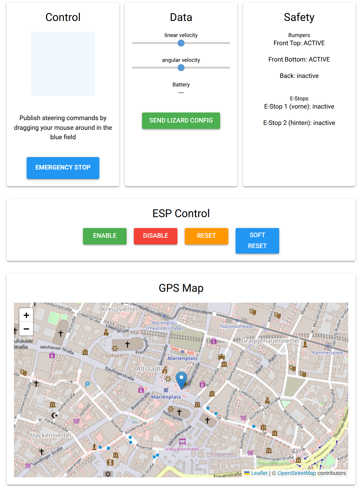

# Sowbot (ROS 2 stack)

An open-source, containerised ROS2 Jazzy stack for autonomous agricultural robotics. This repository provides the drivers and orchestration for the Sowbot platform, featuring RTK-GNSS localisation and ESP32-based hardware control.

Development is led by the <a href="https://agroecologylab.org.uk" target="_blank">Agroecology Lab</a> building on the core developed by <a href="https://github.com/zauberzeug/" target="_blank">Zauberzeug</a>.

Reference open hardware stack(s) under development at [Sowbot.co.uk](https://sowbot.co.uk) in addition to orginal [Zauberzeug Field Friend](https://github.com/zauberzeug/)

[Quick start](https://github.com/Agroecology-Lab/feldfreund_devkit_ros#quick-start) **Collaborators welcome.** See [CONTRIBUTING.md](CONTRIBUTING.md). 

Contact: [sowbot.co.uk](https://sowbot.co.uk)

**Milestone — multi-row mission following validated in Gazebo:**

[](https://www.youtube.com/watch?v=A0CVNcp19vU)

## Sowbot Roadmap

| # | Feature | Description | Status | TRL | Phase |
|---|---------|-------------|--------|-----|-------|
| **FOUNDATION** | | | | | **2025** |
| F1 | Containerised deployment | Full ROS 2 Jazzy stack managed via Docker and `manage.py`. Live volume mapping to `/workspace`. Build, full-build, and `+sim` build modes. | Done | 6 | 2025 |
| F2 | Stable device addressing | `fixusb.py` with Jetson/generic architecture detection, kernel `low_latency` mode, and udev symlink generation. Writes `.env` consumed by all launch files. Note: `run_neo()` never calls `fixusb.py` so `.env` is not written for neo-only runs. | Done | 6 | 2025 |
| F3 | Teleop dashboard | NiceGUI web cockpit on `:80`. Three-tab interface: **Nav** (joystick, e-stop, topo map, node-drop, track mode), **Mission** (fields2cover corner entry, F2C row plan generator, reorderable mission queue), **System** (telemetry, safety indicators, GPS leaflet map). | Done | 6 | 2025 |
| F4 | ublox DGNSS driver | Dual F9P moving-base configuration with dynamic port assignment via `fixusb.py`. | Done | 6 | 2026 |
| F5 | Diagnostics TUI | `agbot-diagnostic.py` terminal status view of all hardware topics. Run inside container via `login.sh`. | Done | 6 | 2025 |
| **MVP FIELD** | | | | | **2026** |
| M1 | Agri Open Core platform integration | Demonstrates AOC platform abstraction on affordable ARM hardware accessible to smallholders. | ~60% Done | 3 | 2026 |
| M2 | Topological navigation + Nav2 | LCAS `topological_navigation` (`aoc_refactor` branch) building in Dockerfile. RViz visualisation confirmed working. Self-contained `navigation2.py` with A\* route planning, explicit state machine, and `row_traversal` / `NavigateToPose` / `goal_align` edge actions. `fake_nav2_server` with `/limbic_row_follow` stub enables full pipeline testing in sim. `sim_nav.launch.py` now routes through real Nav2. **Multi-row mission following (entry/exit node pairs across boustrophedon rows) validated end-to-end in Gazebo.** Pending: Jazzy field validation on hardware. | ~85% Done | 4 | 2026 |
| M2a | fusioncore Nav2 bridge | `fusioncore_node` launched via `devkit.launch.py`. Nav2 topic remapping shim wired. Pending: end-to-end test on live hardware. | ~75% Done | 4 | 2026 |
| M3 | Open-field row-crop scenario | Live node-drop in UI. F2C row plan generator implemented in `ui_node.py` (corners → swaths → topo rows via `_run_f2c()`). YAML written to `/workspace/maps/`, `switch_topological_map` with fallback. Topo map auto-generated at container start. Multi-row traversal across generated swaths confirmed in sim. Pending: tmap2 authoring from real field survey; F2C obstacle costmap integration. | ~70% Done | 4 | 2026 |
| M4 | RTK-GNSS localisation | Full pipeline implemented: dual F9P, shims, UKF fusion, NTRIP. Lever-arm offsets in `fusioncore.yaml` are zeroed placeholders (commented `# measured` TODOs). Pending: antenna lever-arm measurement, live hardware test. | ~75% Done | 3 | 2026 |
| M5 | Dual-SBC ROS 2 stack | `manage.py` detects crossover interface, builds `CYCLONEDDS_URI` peer config and injects into Docker. `neo.launch.py` and `devkit.launch.py` finalised for Limbic+Neo split. `zenoh_config.json` not present in repo (listed as pending). No `rmw_zenoh_cpp` launch args visible in current launch files — DDS peer path is the active one. | ~50% Done | 3 | 2026 |
| M6 | Gazebo simulation | `sowbot_sim.launch.py` + `sim_nav.launch.py` fully restructured. `kill_fake_nav2_on_clock` implemented. `use_sim_time=True` now threaded through topo stack. **Multi-row mission following demonstrated end-to-end (see video above).** | ~90% Done | 4 | 2026 |
| M7 | Sentor safety monitoring | `sowbot_monitor.yaml` fully authored (e-stop, bumpers, battery, camera, odom, neo_vision heartbeat, node monitors). `sentor_node.py` wired into `devkit.launch.py`. Pending: smoke-test on live hardware; battery voltage cutoff needs field confirmation (`# TODO: CONFIRM` in YAML). | ~75% Done | 3 | 2026 |
| M8 | Visual crop-row navigation | `sowbot_row_follow` package implemented. ExG+Otsu, visual servo, `limbic_row_follow_node.py` as Nav2 action server. Cancel and heartbeat-loss safety. TSM row-swap hold with 6-second debounce implemented. Camera calibration params required before field use. Pending: camera calibration, field test. | ~75% Done | 3 | 2026 |
| **PRODUCTION** | | | | | **~2027** |
| P1 | STM32H7 + copper-rs MCU | Replace ESP32/Lizard DSL with STM32H745 running copper-rs statically-scheduled Rust firmware. Hard real-time motor PID, hardware safety interlocks. | Research | 2 | 2027 |
| P2 | CANopen bus | ISO 11898 FDCAN at 500 kbit/s / 2 Mbit/s. lely-core CANopen master on T527 native M_CAN. DSP402 drive profile. | Research | 2 | 2027 |
| P3 | RT kernel + core isolation | PREEMPT_RT on Limbic T527. `isolcpus=4-7`, RTK EKF on core 2 (SCHED_FIFO 60), AOC nav on cores 4-6, watchdog on core 5. GbE/CAN IRQ pinned to core 0. | Planned | 2 | 2027 |
| P4 | ROFS image | Read-only rootfs — Ubuntu Noble minimal or Yocto with RT kernel, pre-built LCAS topo nav, Nav2, `rmw_zenoh_cpp`. Immutable field deployment. | Research | 1 | 2027 |
| **END-EFFECTORS** | | | | | **TBD** |
| E1 | Delta weeding module | Open-Weeding-Delta precision mechanical weeding. CANopen actuator node on delta controller. | Research | 1 | TBD |
| E2 | LASER weeding module | Laudando LASER integration. Requires E-Stop interlocking with CANopen safety chain. | Research | 1 | TBD |
| **DATASETS & COLLABORATION** | | | | | **Ongoing** |
| D1 | UK open-field dataset | Field imagery and GNSS logs from UK agroecological farm conditions. CC licence. | Planned | 2 | 2026 |
| D2 | Caatinga biome dataset | Semi-arid row-crop imagery from caatingarobotics. Validated on T527 AIPU. | Active | 5 | 2026 |

<sub>TRL = Technology Readiness Level (1–9, ESA/NASA scale): 1–2 concept/formulation, 3 proof of concept, 4 validated in lab/simulation, 5 validated in relevant (non-lab) environment, 6 demonstrated in relevant environment, 7 operational prototype, 8 qualified system, 9 field-proven. Self-assessed per feature, not a formal review — adjust as needed.</sub>

### Collaboration

This project is built on and aims to maintain upstream compatibility with [zauberzeug/feldfreund\_devkit\_ros](https://github.com/zauberzeug/feldfreund_devkit_ros).

High Level navigation is developed from the work of [Lincoln Centre for Autonomous Systems (LCAS)](https://lcas.lincoln.ac.uk) as part of the [Agri-OpenCore](https://agri-opencore.org) open ROS 2 ecosystem for agricultural robotics.

Perception models, Nav2 stack, datasets and simulation environments are developed in collaboration with [caatingarobotics](https://github.com/joaodemouragy-hash/caatingarobotics), The [Sowbot Jazzy fork](https://github.com/samuk/caatingarobotics) is pending upstream merge.


# Rewrite-from-Scratch Cost Estimate

Estimate for reimplementing the full stack pulled in by `feldfreund_devkit_ros/docker/Dockerfile` (caatinga-dev), instead of building on ROS 2 Jazzy + Nav2 + third-party packages.

## Foundational infra

| Component | Rewrite hrs |
|---|---|
| ROS 2 core + Nav2 | 120,000–250,000 |

## Packages pulled in & developed in house

| Package | What it does | Rewrite hrs |
|---|---|---|
| Gazebo Harmonic (`INSTALL_SIM`) | Physics engine + rendering + SDF | 15,000–70,000 |
| `topological_navigation` (LCAS) | Topo-nav stack | 4,000–8,000 |
| Fields2Cover | Coverage path planning | 2,500–5,000 |
| YOLOX | Real-time object detector arch | 4,000–10,000 |
| NiceGUI (web cockpit) | Web UI framework | 4,000–8,000 |
| `ublox_dgnss` | RTK GNSS driver | 1,200–2,500 |
| `septentrio_gnss_driver` | RTK GNSS driver | 1,200–2,500 |
| `vision_opencv` (cv_bridge, image_geometry) | ROS↔OpenCV bridge | 1,000–2,500 |
| `fusioncore` | UKF GNSS/IMU fusion | 800–2,000 |
| Lizard | ESP32 firmware bridge | 800–1,500 |
| `virtual_maize_field` | Gazebo row-crop world gen | 400–1,200 |
| Forest3D | Procedural terrain gen | 400–1,200 |
| `sentor`, `mongodb_store`, `ros2graph_explorer`, `ros2grapher` | Monitoring/dev-tool glue | 600–1,800 |
| `sowbot_row_follow` TSM vision pipeline | Line fitting, ExG masking, multi-row detection, gating | 800–1,800 |
| `sowbot_row_follow` state machine + action server | FOLLOW_ROW transitions, control loop integration | 550–1,300 |
| `sowbot_row_follow` field tuning/debugging | Reaching current maturity | 400–1,000 |

**Subtotal, non-core: ~37,750–120,100 hrs**

## Total

**~157,750–370,100 engineering hours (≈76–183 person-years)**

Excludes OpenCV, GDAL, Boost, Eigen, PyTorch — rewriting those too pushes this into the millions of hours and isn't a serious option.

At a $120/hr fully-loaded US engineering rate, that's **≈$18.9M–$44.4M**.


# ⚠️ CRITICAL SAFETY WARNING: 

 This software is under active development and may be broken at any given moment. For a stable reference implementation see the upstream Zauberzeug project.

**THIS SOFTWARE COULD CONTROL PHYSICAL HARDWARE CAPABLE OF PRODUCING SIGNIFICANT KINETIC FORCE.**

1. **EXPERIMENTAL STATUS**: This branch ('sowbot') contains experimental code generated and 
   refined with AI assistance. It has NOT undergone full-scale field validation.
2. **STATUTORY NOTICE (UK)**: Usage of this software is at the user's sole risk. While 
   standard open-source licenses apply, users are reminded that operating agricultural 
   robotics requires a professional duty of care.
3. **MANDATORY HARDWARE SAFETY**: Under no circumstances should this software be used 
   to control a robot of any size without a independent, hard-wired, physical Emergency Stop (E-Stop) 
   system. Software-based stops (such as /estop/soft) are NOT a substitute for 
   Category 0 or 1 hardware safety stops.
4. **NO LIABILITY**: To the extent permitted by the laws of England and Wales, the 
   contributors exclude all liability for property damage, crop loss, or indirect 
   consequential damages.

### Health Warning

This repo may contain traces of LLM slop, We've done our best to mitigate this. If you are allergic to slop, please help us refactor.


## Quick Start

### 0. Install dependencies

#### Linux 
- [Git](https://github.com/git-guides/install-git)
- [Docker](https://docs.docker.com/engine/install/)
- ```sudo apt install python3-serial```

#### Mac
- xcode-select --install
- [Git](https://github.com/git-guides/install-git)
- [Docker](https://docs.docker.com/engine/install/)


& See notes below

#### Windows?
- [Git](https://github.com/git-guides/install-git)
- [Docker](https://docs.docker.com/engine/install/)

Untested

### 1. Clone the Repository
Open a terminal on your host machine and download the workspace:
```bash
git clone -b caatinga-dev https://github.com/Agroecology-Lab/feldfreund_devkit_ros.git
cd feldfreund_devkit_ros
```

### 2. Build & Launch
Use the management script to build the ROS 2 workspace and launch the robot stack. This script automatically handles hardware discovery and port permissions:
```bash
./manage.py full-build
xhost +local:docker
./manage.py 
```
Access http://localhost to access the WebUI

*Notes for Mac users:
Port mappings may not bridge to the host on macOS Docker Desktop (Docker runs inside a Linux VM there), making `localhost` unreachable. Fix this by adding explicit port mappings to docker run flags, [cmd 250 of manage.py](https://github.com/Agroecology-Lab/feldfreund_devkit_ros/blob/8dcfde1b813bd829756a372d88195bb2b9249313/manage.py#L250) 

Drop the xhost line, you'll still be able to access GUI tools via a browser.

#### Linux

If you're getting this error:

```
docker: Error response from daemon: could not select device driver "" with capabilities: [[gpu]]
```
You'll need to install the [Nvidia Container runtime](https://docs.nvidia.com/datacenter/cloud-native/container-toolkit/latest/install-guide.html).

#### Gazebo

If you'd like to use Gazebo then add a +sim argument to your build instruction

```bash
./manage.py full-build +sim
xhost +local:docker
./manage.py 
```

## Management & Tools

### manage.py
The primary entry point for the system. While it runs the full stack by default, it supports several optional arguments for development:

| Command | Logic / Argument | Resulting Action |
|:---|:---|:---|
| `./manage.py` | (No arguments) | Runs `run_runtime()` immediately using live volumes.|
| `./manage.py build` | `build` | local-only, fully cached including external clones |
| `./manage.py build +pull` | `build` | Re-clones the 9 external repos, keeps apt/pip/local layers cached |
| `./manage.py build +pull +sim` | `build ` | Same, plus INSTALL_SIM=true |
| `./manage.py full-build` | `full-build` | Runs `run_build(full=True)`. Cleans system & Re-installs all system dependencies. |
| `./manage.py neo` | `neo` | Runs `neo`. Runs only the line following code for the second 'neo'(cortex) perception SBC. Then check `http://localhost:8080` |
| `./manage.py neo-tsm` | `neo-tsm` | Runs `neo-tsm`. Runs experimental line following informed by [Vision based Crop Row Navigation under Varying Field Conditions in Arable Fields - Rajitha de Silva1, Grzegorz Cielniak2 and Junfeng Gao](https://arxiv.org/pdf/2209.14003). Then check `http://localhost:8080` |
| `./manage.py pull-caatinga` | `pulls & builds vision pipeline` | Requires the container to already be running |


### One-command sim launch (TMuLE)

[TMuLE](https://github.com/marc-hanheide/TMuLE) brings the whole row-following sim up in a single `tmux` session — one window per process — instead of running the three launch steps by hand in separate terminals:

```bash
tmule -c tmule/row_follow_sim.yaml launch
tmux attach -t row_follow_sim
```

That starts `./manage.py --sim` (nav stack + Nav2 + UI), Gazebo (`sowbot_sim.launch.py`) and the crop-row CV node (`crop_row_nav.launch.py`), each in its own tmux window. `launch` returns immediately and leaves the session detached, so attach to watch the panes come up (and to type the `nav_stack` sudo password).

One-time install (`tmux` plus the tool itself):

```bash
sudo apt install -y tmux pipx
pipx install tmule && pipx ensurepath   # then open a new shell
```

Stop the stack with `tmule -c tmule/row_follow_sim.yaml stop`; re-attach later with `tmux attach -t row_follow_sim`.

> If a runtime container is **already running**, the `nav_stack` window will fail on a `docker run` name collision. Either `docker stop sowbot_runtime` first, or launch just the windows that reuse the container: `tmule -c tmule/row_follow_sim.yaml launch -w gazebo`.

#### tmux basics

The stack runs in a *detached* tmux session named `row_follow_sim`, so closing your terminal does not kill it — **detaching is not stopping**. The session holds one window per sub-system (plus a stray `0: bash` that tmux always creates):

```
0: bash   1: nav_stack   2: gazebo   3: crop_row
```

Every shortcut starts with the prefix `Ctrl-b` — press and release it, then the next key:

| Keys | Resulting Action |
|:---|:---|
| `Ctrl-b` `d` | Detach — leaves the whole stack running in the background |
| `Ctrl-b` `w` | Interactive window picker (easiest way to move around) |
| `Ctrl-b` `1` / `2` / `3` | Jump straight to `nav_stack` / `gazebo` / `crop_row` |
| `Ctrl-b` `n` / `p` | Next / previous window |
| `Ctrl-b` `[` | Scroll back through ROS log output — arrows/PgUp, `q` to exit |
| `Ctrl-b` `z` | Zoom the current pane fullscreen (press again to unzoom) |
| `Ctrl-b` `?` | List every binding |

```bash
tmux ls                              # list sessions
tmux attach -t row_follow_sim        # attach
tmux kill-session -t row_follow_sim  # nuke the session
```

Scrolling back (`Ctrl-b` `[`) is the one you'll reach for most — it's how you read ROS output that has already scrolled past. For mouse-wheel scrolling instead, add `set -g mouse on` to `~/.tmux.conf`.

Scenario configs live in [`tmule/`](tmule/) — see [`tmule/README.md`](tmule/README.md) to tweak launch arguments or add your own scenario.

### Interactive Shell
To enter the running container for debugging or manual ROS 2 commands:
```bash
./login.sh
```

### Diagnostics
If hardware is connected but topics are not flowing, run the diagnostic tool from inside the container:

#### After running ./login.sh
```bash
python3 agbot-diagnostic.py
```


You can also make it verbose with:
```bash
python3 agbot-diagnostic.py full
```

## Sketch of MVP 2026 architecture

### 1. The Lizard Brain (RT Microcontroller)
* **Hardware:** ESP32 MCU.
* **Software:** Lizard DSL.
* **Role:** Hard Real-Time Execution.
* **Function:** Motor PID control and physical safety (bumpers/cliffs).
* **I/O:** 3.3V UART receiving $v, \omega$ via the `teleop_lizard` ROS 2 bridge.

### 2. The Limbic System (Executive)
* **Hardware:** Avaota A1 #1 (Allwinner T527).
* **Software:** ROS 2 Jazzy + `topological_navigation` (AOC branch).
* **Role:** Navigation Executive.
* **Function:** Runs the Topological Navigation stack. UBLOX sensors Manages the move_base sequence and Action on Condition (AOC) logic.
* **I/O:** Connects to u-blox via USB/UART using `ublox_dgnss` node. Translates graph goals into velocity commands for the Lizard Brain.

**<1GbE interconnect between 2&3>**

### 3. The Neo (Perception)
* **Hardware:** Avaota A1 #2 (Allwinner T527 + NPU).
* **Software:** Dockerised ROS 2 Jazzy.
* **Role:** Asynchronous Perception.
* **Function:** NPU-accelerated inference (YOLO/Object tracking) and sensor fusion.
* **Connectivity:** Native Zenoh integration via `rmw_zenoh_cpp`. Publishes environment states and "Conditions" to the Zenoh network.

                          |

## Sketch of possible eventual ~2027 architecture

### 1. The Lizard Brain (Hardware Abstraction)
* **Hardware:** [STM32 H7 MCU](https://oshwhub.com/6676a/stm32h745zit6_core).
* **Software:** copper-rs.
* **Role:** Hard Real-Time Execution.
* **Function:** Manages motor PID loops and hardware-level safety interlocks.
* **I/O:** Canbus

### 2. The Limbic System (Executive)
* **Hardware:** Avaota A1 #1 (Allwinner T527).
* **Software:** RT kernel, Buildroot `copper-rs`
* **Role:** Deterministic Executive.
* **Function:** UBLOX sensors, Executes Action on Condition (AOC) logic for topological navigation.
* **Data Entry:** Directly consumes Zenoh keys from the Neo board to trigger mission state transitions and motion planning.

| Core(s)   | Role                | Allocation Strategy                                                                 |
| :-------- | :------------------ | :---------------------------------------------------------------------------------- |
| Core 0    | OS / I/O            | Handles kernel house-keeping, SSH, and the 1GbE driver interrupts.                  |
| Core 1    | Zenoh / Neo-link    | Dedicated to the Zenoh router and serializing incoming "Nice-to-Have" data.         |
| Cores 2-6 | The Pilot (Nav)     | This is where the RTK EKF, Path Planner, and Task Graph live.                       |
| Core 7    | The Bridge (Lizard) | Dedicated to SocketCAN and the high-frequency heartbeat to the STM32 (Lizard).      |


**<1GbE interconnect between 2&3>**

### 3. The Neo (Perception)
* **Hardware:** Avaota A1 #2 (Allwinner T527 + NPU).
* **Software:** Dockerised ROS 2 Jazzy & Dockerised CV packages
* **Role:** Asynchronous Perception.
* **Function:** NPU-accelerated inference (YOLO/Object tracking) and sensor fusion.
* **Connectivity:** Native Zenoh integration via `rmw_zenoh_cpp`. Publishes environment states and "Conditions" to the Zenoh network.


## Licenses & papers

# Sowbot / feldfreund_devkit_ros — Dependency Licence Audit

| Component | Source | Licence | Commercial use | Academic Paper | Notes |
|---|---|---|---|---|---|
| **feldfreund_devkit_ros** (root) | your repo | MIT (©Zauberzeug GmbH & Agroecology Lab) | ✅ | *None (Local Project)* | Derivative of upstream field-friend; retain Zauberzeug notice |
| **devkit_driver** | local | MIT (©ATB) | ✅ | *None (Utility Driver)* | Retain ATB copyright notice |
| **devkit_ui** | local | MIT (©Agroecology Lab) | ✅ | *None (UI Extension)* | |
| **devkit_bringup** | local | MIT | ✅ | *None (Config/Launch)* | Corrected from `proprietary` |
| **sowbot_row_follow** | caatingarobotics | BSD-2-Clause | ✅ | [de Silva et al., 2024](https://arxiv.org/abs/2209.14003) | LICENSE file fixed to match header/metadata; updated to use the Transition State Model (TSM) for visual crop row navigation; ©PRBonn + ©Agroecology Lab |
| **caatingarobotics** *(devkit_simulation, caatinga_nav, caatinga_vision)* | github.com/samuk | Apache-2.0 | ✅ | *None (Fork Infrastructure)* | Your fork (row_follow is the BSD-2 exception, above) |
| **topological_navigation** | LCAS (`aoc_refactor`) | Apache-2.0 (©LCAS) | ✅ | [Fentanes et al., 2015](https://www.researchgate.net/publication/282752920_Now_or_later_Predicting_and_maximising_success_of_navigation_actions_from_long-term_experience) | High-level planner; derived from the EU STRANDS long-term autonomy project framework |
| **fusioncore** | manankharwar | Apache-2.0 | ✅ | [Kharwar, 2026](https://arxiv.org/abs/2605.25239) | GNSS fusion; patched in-build; retain NOTICE if present |
| **Forest3D** | unitsSpaceLab | GPL (©UNITS Space Lab) | Do not ship in final product | [Cottiga,S., Bourr, K., & Seriani, S. (2026)](https://kbourr.com/#publications)| Sim-only — 3D forestry /agriculture simulation environment |
| **ublox_dgnss** | aussierobots | Apache-2.0 | ✅ | *None (Hardware Driver)* | GNSS driver |
| **sentor** | LCAS (fork of francescodelduchetto/sentor) | MIT | ✅ | *None (Monitoring Tool)* | Topic- and node-monitoring health node |
| **ros2graph_explorer** | nilseuropa | BSD-3-Clause | ✅ | *None (Debug Tool)* | Dev/debug graph inspector |
| **Fields2Cover v2.0.0** | Fields2Cover | BSD-3-Clause | ✅ | [Mier et al., 2023](https://doi.org/10.1109/LRA.2023.3248439) | Built from source; pulls OR-tools (Apache-2.0) + GDAL (MIT) |
| **lizard** | Agroecology-Lab | MIT (©Zauberzeug GmbH) | ✅ | *None (Firmware Tool)* | ESP32 tooling; retain Zauberzeug notice |
| **YOLOX 0.3.0** + yolox_nano weights | Megvii | Apache-2.0 | ✅ | [Ge et al., 2021](https://arxiv.org/abs/2107.08430) | Confirm weights terms for commercial use |
| **PyTorch (CPU)** | Meta | BSD-3-Clause | ✅ | [Paszke et al., 2019](https://papers.nips.cc/paper/9015-pytorch-an-imperative-style-high-performance-deep-learning-library) | Core machine learning runtime engine |


===============================================================

## Feldfreund DevKit ROS 
(Below from original Zauberzeug forked repo)

Feldfreund DevKit ROS is a comprehensive ROS2 package that handles the communication and configuration of various Feldfreund components:

- Communication with Lizard (ESP32) to control the Feldfreund
- GNSS positioning system
- Camera systems (USB and AXIS cameras)
- Example UI to control the robot

All launch files and configuration files (except for the UI) are stored in the `devkit_bringup` package.

## Components

### DevKit driver

The DevKit driver (based on [ATB Potsdam's field_friend_driver](https://github.com/ATB-potsdam-automation/field_friend_driver)) manages the communication with the ESP32 microcontroller running [Lizard](https://lizard.dev/) firmware - a domain-specific language for defining hardware behavior on embedded systems.

The package provides:

- `config/devkit.liz`: Basic Lizard configuration for DevKit robot
- `config/devkit.yaml`: Corresponding ROS2 driver configuration

Available ROS2 topics:

- `/cmd_vel` (geometry_msgs/Twist): Control robot movement
- `/odom` (nav_msgs/Odometry): Robot odometry data
- `/battery_state` (sensor_msgs/BatteryState): Battery status information
- `/bumper/front_top` (std_msgs/Bool): Front top bumper state
- `/bumper/front_bottom` (std_msgs/Bool): Front bottom bumper state
- `/bumper/back` (std_msgs/Bool): Back bumper state
- `/estop/soft` (std_msgs/Bool): Software emergency stop control
- `/estop/front` (std_msgs/Bool): Hardware front emergency stop state
- `/estop/back` (std_msgs/Bool): Hardware back emergency stop state
- `/configure` (std_msgs/Empty): Trigger loading of the Lizard configuration file

### Camera System

The camera system supports both USB cameras and AXIS cameras, managed through a unified launch system in `camera_system.launch.py` that handles USB cameras, AXIS cameras, and the Foxglove Bridge for remote viewing.

The USB camera system provides video streaming through ROS2 topics using the `usb_cam` ROS2 package. Camera parameters can be configured through `config/camera.yaml`.

The AXIS camera system integrates with the [ROS2 AXIS camera driver](https://github.com/ros-drivers/axis_camera/tree/humble-devel) to support multiple IP cameras with individual streams. Each camera can be configured through `config/axis_camera.yaml`, with credentials managed through `config/secrets.yaml` (template provided in `config/secrets.yaml.template`). The cameras' authentication mode (basic or digest) might need to be configured - see [AXIS Camera Authentication](#axis-camera-authentication) section for details.

The visualization system integrates with [Foxglove Studio](https://foxglove.dev/) for remote camera viewing, supporting compressed image transport. The Foxglove Bridge is accessible via WebSocket connection on port 8765.

### GNSS System

The GNSS system uses the [Septentrio GNSS driver](https://github.com/septentrio-gnss/septentrio_gnss_driver) with the default `config/gnss.yaml` configuration. Available topics:

- `/pvtgeodetic`: Position, velocity, and time in geodetic coordinates
- `/poscovgeodetic`: Position covariance in geodetic coordinates
- `/velcovgeodetic`: Velocity covariance in geodetic coordinates
- `/atteuler`: Attitude in Euler angles
- `/attcoveuler`: Attitude covariance
- `/gpsfix`: Detailed GPS fix information including satellites and quality
- `/aimplusstatus`: AIM+ status information

### DevKit UI

The example UI provides a robot control interface built with NiceGUI, featuring a joystick control similar to turtlesim. It gives you access to and visualization of all topics made available by the DevKit driver, including:

- Robot movement control through a joystick interface
- Real-time visualization of GNSS data
- Monitoring of safety systems (bumpers, emergency stops)
- Software emergency stop control

The interface is accessible through a web browser at `http://<ROBOT-IP>:80` when the robot is running.

<div align="center">
  
  <div style="font-size: 0.95em; color: #555; margin-top: 0.5em;">
    Example UI: Control, data, safety, and GPS map in one interface.
  </div>
</div>

## Docker Setup

### Using Docker Compose

1. Build and run the container:

```bash
cd docker
docker-compose up --build
```

2. Run in detached mode:

```bash
docker-compose up -d
```

3. Attach to running container:

```bash
docker-compose exec devkit bash
```

4. Stop containers:

```bash
docker-compose down
```

The Docker setup includes:

- All necessary ROS2 packages
- Lizard communication tools
- Camera drivers
- GNSS drivers

## Connect to UI

To access the user interface (UI), follow these steps:

1. **Connect to the Robot's Wi-Fi:**
   Join the robot's WLAN network.

2. **Open the UI in your browser:**
   Navigate to:

   ```
   http://<ROBOT-IP>:80
   ```

   (Replace `<ROBOT-IP>` with the actual IP address once you have it.)

## Launch Files

The system can be started using different launch files:

- `devkit.launch.py`: Launches all components
- `devkit_nocams.launch.py`: Launches all components without the cameras
- `devkit_driver.launch.py`: Launches only Feldfreund DevKit driver
- `camera_system.launch.py`: Launches complete camera system (USB + AXIS) and Foxglove Bridge
- `usb_camera.launch.py`: Launches USB camera only
- `axis_cameras.launch.py`: Launches AXIS cameras only
- `gnss.launch.py`: Launches GNSS system
- `ui.launch.py`: Launches the example UI node

To launch the complete system:

```bash
ros2 launch devkit_bringup devkit.launch.py
```

## AXIS Camera Authentication

The AXIS cameras can be configured to use either digest or basic authentication. To check and configure the authentication mode:

1. Check current authentication settings:

```bash
curl --digest -u root:pw "http://192.168.42.3/axis-cgi/admin/param.cgi?action=list&group=Network.HTTP" | cat
```

2. Switch authentication mode (e.g., from digest to basic):

```bash
curl --digest -u root:pw "http://192.168.42.3/axis-cgi/admin/param.cgi?action=update&Network.HTTP.AuthenticationPolicy=basic" | cat
```

Replace `root:pw` with your camera's credentials and `192.168.42.3` with your camera's IP address. The authentication mode can be set to either `basic` or `digest`. Note that you should always use the `--digest` flag in these commands even when switching to basic auth, as the camera's current setting might be using digest authentication.

## Quickstart guide

### 1. Clone the Repository

```bash
git clone https://github.com/zauberzeug/devkit_ros.git
cd devkit_ros
```

### 2. Validate Configuration

Before building, check and adjust if needed:

1. **ROS2 Configuration** (`devkit_bringup/config/devkit.yaml`):
   - Verify `serial_port` matches your setup (default: "/dev/ttyTHS0")
   - Check `flash_parameters` for your hardware (default: "-j orin --nand")

2. **Lizard Configuration** (`devkit_bringup/config/devkit.liz`):
   - Verify motor configuration matches your hardware
   - Check pin assignments for bumpers and emergency stops
   - Adjust any other hardware-specific settings

### 3. Build with Docker

```bash
./docker.sh u
```

### 4. Send Lizard Configuration

Once the system is running:

- Use the "Send Lizard Config" button in the UI
- Or use the `/configure` topic in ROS2

### 5. Ready to Go

Check the UI at `http://<ROBOT-IP>:80` to control and monitor your robot.

## Future features

This repository is still work in progress. Please feel free to contribute or reach out to us, if you need any unimplemented feature.

- Complete tf2 frames
- Handle camera calibrations
- Robot visualization
